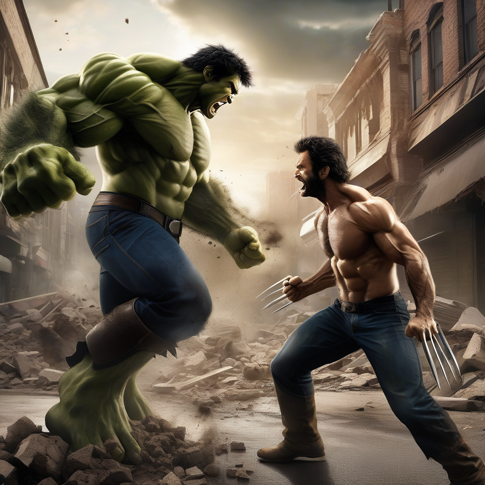

# Laboratorio: Generación de imágenes con Stable Diffusion XL

Laboratorio de IA generativa texto-a-imagen usando la librería `diffusers` de Hugging Face.

## Modelo utilizado

**[stabilityai/stable-diffusion-xl-base-1.0](https://huggingface.co/stabilityai/stable-diffusion-xl-base-1.0)**, cargado con `AutoPipelineForText2Image` y ejecutado en CPU (`float32`).

Parámetros de generación:

| Parámetro             | Valor |
| --------------------- | ----- |
| `num_inference_steps` | 25    |
| `guidance_scale`      | 7.0   |
| `height`              | 1024  |
| `width`               | 1024  |

## Prompt utilizado

```text
Epic cinematic battle between Hulk and Wolverine in the middle of a destroyed city street, Hulk roaring furiously and smashing the ground with enormous strength, Wolverine charging toward Hulk with his adamantium claws extended, intense face expressions, powerful muscular poses, debris and dust flying through the air, shattered concrete, dramatic stormy sky, cinematic lighting, strong backlight, dynamic action composition, low camera angle, dramatic perspective, detailed superhero costumes, realistic skin and textures, highly detailed characters, intense atmosphere, photorealistic, sharp focus, high contrast, blockbuster superhero movie poster, epic scale, masterpiece, 8k
```

Además se usó un *negative prompt* para evitar imágenes borrosas, de baja calidad, anatomía deforme, texto, logos o marcas de agua (ver [src/sd_xl_genai/__init__.py](src/sd_xl_genai/__init__.py)).

## Imagen generada



## Requisitos

- Python 3.12
- [uv](https://docs.astral.sh/uv/)
- Dependencias: `diffusers`, `transformers`, `accelerate`, `torch`

## Ejecución

```bash
uv run python src/sd_xl_genai/__init__.py
```

El programa pide el prompt por consola y guarda el resultado en `imagen.png`.

> Nota: SDXL en CPU es lento (puede tardar varios minutos por imagen con 25 pasos a 1024×1024) y la primera ejecución descarga el modelo (~7 GB).
